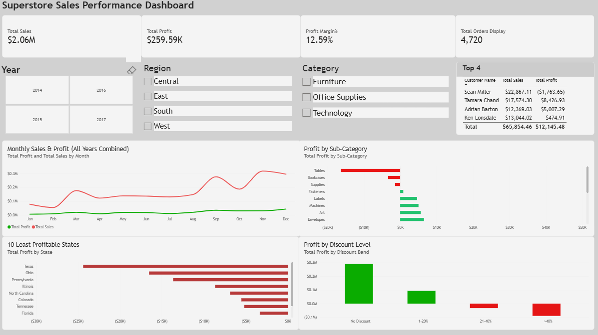
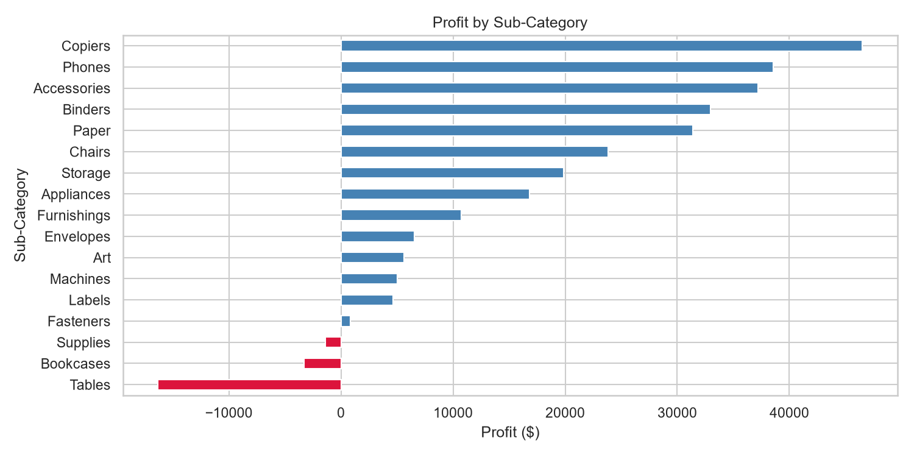
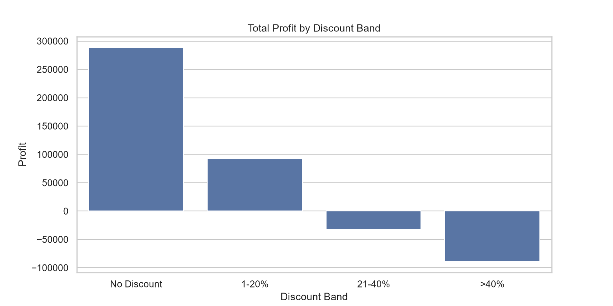
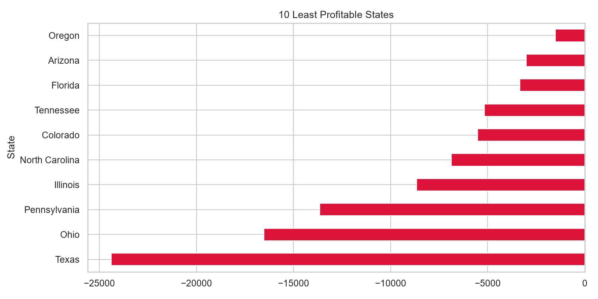
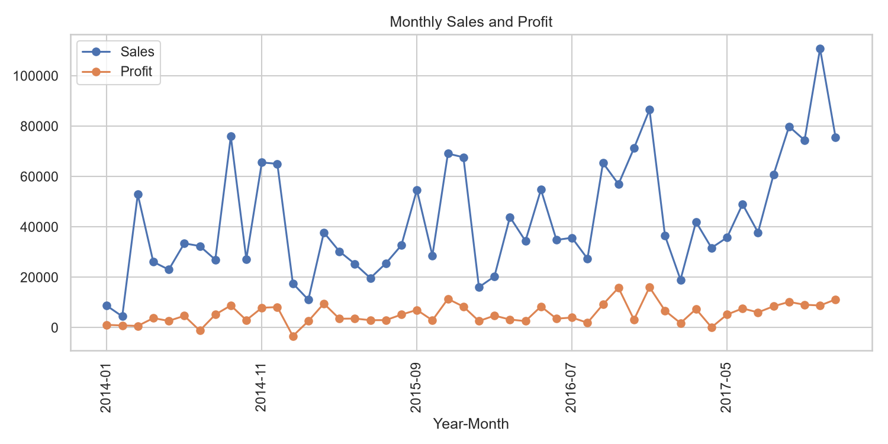
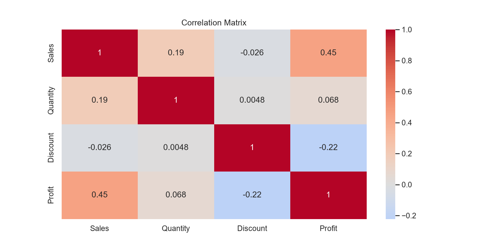

# 📊 Superstore Sales Performance Analysis

**Python (pandas, seaborn) + Power BI | Data cleaning, EDA and an interactive dashboard**



---

## 📌 Problem Statement

A retail company wants to know **where it makes money, where it loses money, and what it should change.**
This project cleans a messy sales dataset, analyses profitability across products, discounts, regions and time, and presents the findings in an interactive Power BI dashboard.

---

## 📂 Dataset

- **Source:** Superstore Sales dataset (Kaggle)
- **Raw size:** 10,355 rows, 21 columns (orders from 2014 to 2017)
- **Key columns:** Order Date, Ship Mode, Segment, Region, State, Category, Sub-Category, Product Name, Sales, Quantity, Discount, Profit
- **Note:** this version of the dataset was intentionally dirty, so data cleaning was a major part of the project.

---

## 🛠️ Tools Used

| Area | Tools |
|---|---|
| Data cleaning and analysis | Python, pandas, NumPy |
| Visualisation | matplotlib, seaborn |
| Environment | Jupyter Notebook (Anaconda) |
| Dashboard | Power BI Desktop, DAX, Power Query |
| Version control | Git and GitHub |

---

## 🧹 Data Cleaning Summary

The raw file had several quality problems that would have produced wrong results if left unfixed:

- **Text instead of numbers:** Sales, Profit, Quantity and Discount were loaded as text because of `$` and comma formatting. Converted them to numeric types.
- **Sentinel value (999999) in Sales:** a placeholder hidden among valid numbers inflated total sales roughly 9x (about $21M instead of about $2M). Replaced it with nulls.
- **Invalid values:** removed negative Sales values, which are impossible.
- **Misspelled categories:** found variants such as `Offcie Supplies`, `Furnitures`, `Tech` and inconsistent capitalisation. Standardised them to three categories.
- **Missing Category values (about 500):** recovered using the Sub-Category to Category mapping instead of dropping the rows.
- **Missing Ship Mode values:** filled with `Unknown`.
- **Duplicates:** removed duplicate rows, including ones that differed only in capitalisation.
- **Missing Sales or Profit:** rows with missing or invalid Sales or Profit (about [ 10 ]% of the data) were excluded, because financial metrics cannot be calculated without them. Values were **not** estimated or invented.

**Final dataset:** 8950  rows used for analysis.

---

## 🔑 Key Insights

1. Total sales of **$2.06M** generated a profit of **$259.59K** (margin **12.59%**) across [ 4,7xx ] orders.
2. **Supplies, Bookcases and Tables** are loss-making sub-categories.
3. **Discounts are strongly linked to losses:**
   - No discount: **29.8%** margin
   - 1-20% discount: **12.2%** margin
   - 21-40% discount: **-15.6%** margin
   - Above 40% discount: **-76%** margin
4. The **Central** region has the lowest margin. The least profitable states are **Texas** (Central) and **Ohio** (East), followed by Pennsylvania and Illinois.
5. Sales peak in **November and December** every year.
6. Large sales do not always mean large profit: some of the highest-spending customers generate losses.

---

## 💡 Recommendations

1. **Cap discounts at 20%** for loss-making sub-categories, and require approval for anything above that.
2. **Review pricing and supplier costs** for Tables, Bookcases and Supplies.
3. **Investigate whether heavy discounting explains the losses in Texas and Ohio**, and set stricter discount limits there if it does.
4. **Prepare inventory and marketing for the November-December peak**, and avoid deep discounts when demand is already high.

> **Note:** the data shows that high discounts and losses occur together. It does not prove that discounts alone cause the losses, so recommendation 3 should be tested before acting.

---

## 📈 Dashboard Features

- **KPI cards:** Total Sales, Total Profit, Profit Margin %, Total Orders
- **Slicers:** Year, Region, Category
- **Visuals:**
  - Monthly Sales and Profit trend
  - Profit by Sub-Category (red for losses, green for profits)
  - 10 Least Profitable States
  - Profit by Discount Level
  - Top customers table
- **DAX measures:** Total Sales, Total Profit, Profit Margin %, Total Orders
- **Design choice:** a ranked bar chart was used instead of a map for state-level profit, because it ranks losses more clearly.

---

## 🖼️ Python Analysis Charts

| Profit by Sub-Category | Profit by Discount Band |
|---|---|
|  |  |

| Least Profitable States | Monthly Trend |
|---|---|
|  |  |



---

## 📁 Repository Structure

```
superstore-sales-analysis/
├── superstore_analysis.ipynb     # Python cleaning and analysis
├── Superstore_Dashboard.pbix     # Power BI dashboard
├── superstore_clean.csv          # Cleaned dataset
├── images/                       # Charts and dashboard screenshot
└── README.md
```

---

## ▶️ How to Run

1. Clone or download this repository.
2. Open `superstore_analysis.ipynb` in Jupyter Notebook and run **Kernel → Restart and Run All**.
3. Open `Superstore_Dashboard.pbix` in Power BI Desktop (Windows) to explore the dashboard.

---

## 👤 Author

**Harshil Rajpurohit**
https://linkedin.com/in/harshil-rajpurohit- | harshilrajpurohit279@gmail.com
